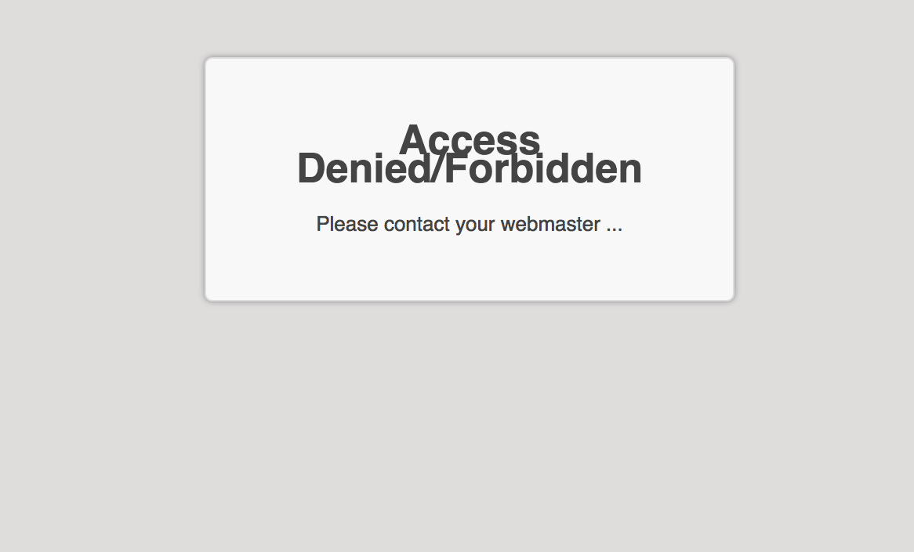

# BEAPI - Maintenance Mode

This simple and lightweight WordPress maintenance plugin puts your WordPress site into maintenance mode.

The <b>major advantage</b>, compared to existing plugins, is that there are no options, it is <b>ready to use</b>!

It was think, while in maintenance mode, to :
- Not impact your SEO by sending a '503 Service Unavailable' status to all unauthenticated clients. This means that it will inhibits search engines from both losing your site's existing content and indexing your maintenance page as well, so your site will not lose its rankings while it is out of service. Content will even be hidden from consumers of the site's RSS or Atom feeds.
- Make continually work the login/loggout process.
- It handle the *activate process in multisite*, which a lot of existing plugins don't.
- If people are logged in they will have the site displayed as normal/expected.

# How ?

We would like to precise that this plugin is simple as pie, anyone can use it but still dev-oriented. The idea is to not have a bunch of options to set before using it, in fact not only one! Because, it is a really pain when working on a multisite.
That is why there as still two filter for developers, which come in the section below.

## IPs whitelist

In certain conditions, it is useful to not trigger the maintenance mode. That's why you can add a file to your project (mu-plugins) to specify a range of IPs to whitelist. At the agency we use it with our VPN IP.
Please find an example of implementation on the following [github](https://github.com/BeAPI/bea-plugin-defaults/blob/master/default-beapi-maintenance-mode.php).

## Customize the maintenance mode template

By default it is the file located in the templates folder : [maintenance.php](https://github.com/BeAPI/beapi-maintenance-mode/blob/master/templates/maintenance.php)
But you can customize this template using the following implementation on [github](https://github.com/BeAPI/bea-plugin-defaults/blob/master/default-beapi-maintenance-mode.php), with a custom template placed wherever you want.

## Composer

It is possible to activate the plugin by composer `wp plugin activate beapi-maitenance-mode [--network]`
If you are a developer and the plugin is not installed, you could also just use a [dedicated composer command](https://github.com/BeAPI/composer-go-maintenance).

# Requirements

- Tested up to 6.3.1
- PHP 7.0+

# Installation

## WordPress

- Download and install using the built-in WordPress plugin installer.
- Site activate in the "Plugins" area of the admin.

## [Composer](http://composer.rarst.net/)

- Add repository source : `{ "type": "vcs", "url": "https://github.com/BeAPI/beapi-maintenance-mode" }`.
- Include `"beapi/beapi-maintenance-mode": "dev-master"` in your composer file for last master's commits or a tag released.

## Contributing

Please refer to the [contributing guidelines](.github/CONTRIBUTING.md) to increase the chance of your pull request to be merged and/or receive the best support for your issue.

### Issues & features request / proposal

If you identify any errors or have an idea for improving the plugin, feel free to open an [issue](../../issues/new) or [create a pull request](../../compare). Please provide as much info as needed in order to help us resolving / approve your request.

# Who ?

## Creator

Created by [Be API](https://beapi.fr), the French WordPress leader agency since 2009. Based in Paris, we are more than 30 people and always [hiring](https://beapi.workable.com) some fun and talented guys. So we will be pleased to work with you.

This plugin is only maintained, which means we do not guarantee some free support. Consider reporting an [issue](#issues--features-request--proposal) and be patient. 

If you really like what we do or want to thank us for our quick work, feel free to [donate](https://www.paypal.me/BeAPI) as much as you want / can, even 1€ is a great gift for buying cofee :)

## License

BEAPI - Maintenance Mode is licensed under the [GPLv3 or later](LICENSE.md).
